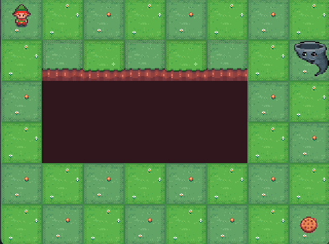

# **Tornado Cliff Env**

<p align="center">
  
</p>


Tornado Cliff Env is a variation of the original Cliff Walking environment.
It involves crossing a grid world while simultaneously avoiding falling off a cliff
and encountering a tornado which blows away the character to a random square in the
grid (including the cliff).

## Description

The game starts with the Elf at the top left corner of a gridworld (`i.e. [0,0]`).
The goal location is always at the bottom right corner
(`i.e. [-1,-1]`), and if the Elf reaches the goal the episode ends.

A cliff runs along the middle of the grid. If the player moves to a cliff location it
returns to the start location.

A tornado begins from a random square, excluding the cliff, and it makes a random walk through
the grid at a given pace (default is 1). If the Elf crosses the tornado, it will
be blown away by a random square in the grid including the cliff.

The player makes moves until they reach the goal.
Resembles Example 6.6 (page 132) from Reinforcement Learning: An Introduction
by Sutton and Barto [<a href="#cliffwalk_ref">1</a>].

It is an adaptation of Gymnasium's Cliff Walking [<a href="#gymnasium_ref">2</a>].

## Action Space

The action shape is `(1,)` in the range `{0, 3}` indicating
which direction to move the player.

- 0: Move up
- 1: Move right
- 2: Move down
- 3: Move left

## Observation Space

The observation depends on the shape of the grid. For a `(6,8)` grid there are 48*48 possible states, corresponding to the position of the Elf and the position of
the tornado. The player cannot be at the cliff, nor at the goal as the latter
results in the end of the episode.

The observation is a tuple representing the player's and the tornado's current
position as current_row * nrows + current_col (where both the row and col start at 0).

The observation is returned as a `Tuple[int, int]`. The first number being the state of the Elf and the second one corresponding to the state of the tornado.

## Starting State

The episode starts with the player in state `[0]` (location [0, 0]). And the tornado
begins at a random state.

## Reward

Each time step incurs a -1 reward unless the player stepped into the cliff,
which incurs a -100 reward.

## Episode End

The episode terminates when the player reaches the goal at the bottom left corner.

## Information

`step()` and `reset()` return a dict with the following keys:

- "p" - transition probability for the state.

As cliff walking is not stochastic, the transition probability returned always 1.0.

## Installation

```bash
git clone https://github.com/factoredai/tornadocliff-env
cd tornadocliff-env
pip install -e .
```

## References

<a id="cliffwalk_ref"></a>[1] R. Sutton and A. Barto, “Reinforcement Learning:
An Introduction” 2020. [Online].
Available: [http://www.incompleteideas.net/book/RLbook2020.pdf](http://www.incompleteideas.net/book/RLbook2020.pdf)

<a id="gymnasium_ref"></a>[2] Farama Foundation, “Gymnasium” 2023. (v0.28.1).
See: [https://github.com/Farama-Foundation/Gymnasium/blob/main/gymnasium/envs/toy_text/cliffwalking.py](https://github.com/Farama-Foundation/Gymnasium/blob/main/gymnasium/envs/toy_text/cliffwalking.py)

## Version History

- v0.0.1: Initial version release
